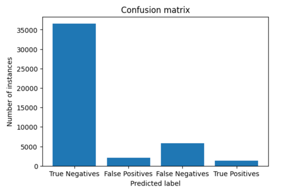

1. Model: Stochastic Gradient Descent Classifier
2. Link to colab: https://colab.research.google.com/drive/1B0cRG__Wgc2OTsQnBlUt6sN6w1DVLZBC?usp=sharing
3. Confusion Matrix:
   
   True Positive: 1097
   True Negative: 37269
   False Positive: 1252
   False Negative: 6055

4. File: knn.pickle
5. Tuning of hyper params did not give any positive boost
6. No feature wights for this model