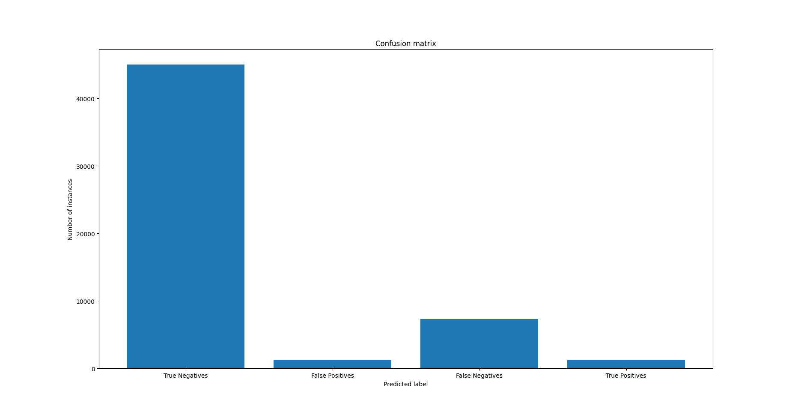
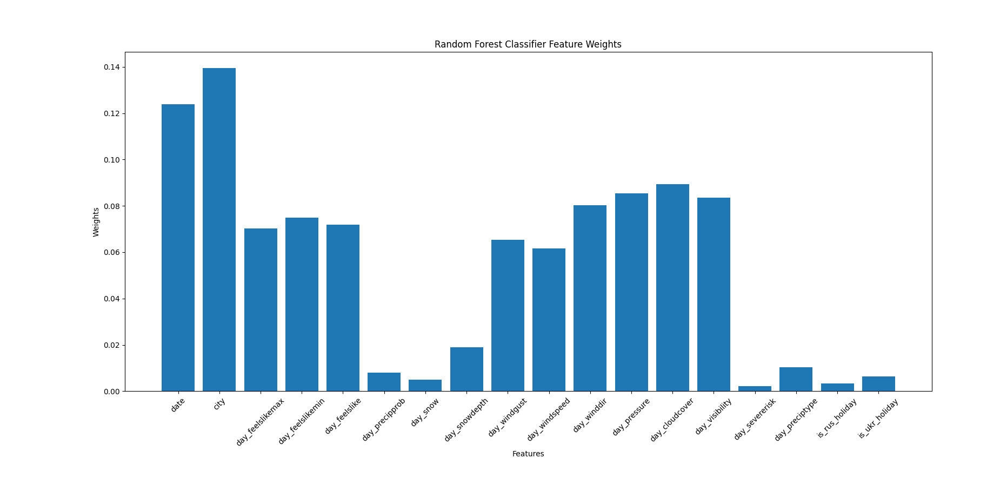

1. Model: Random Forest Classifier

2. Colab: https://colab.research.google.com/drive/16jGYTr4PWmY6zq6rVP9xjMCGvWx9Pflk?usp=sharing

3. Confusion Matrix:
   

    True Positive: 1203  
    True Negative: 45021  
    False Positive: 1227  
    False Negative: 7356

4. File: ```2__random_forest__v1.pkl```

    Accuracy: 0.8433959165799989  
    Precision: 0.49506172839506174  
    Recall: 0.14055380301437084  
    F1-score: 0.21894621894621893

5. Tuning gave no results

6. Feature weights: 
   
