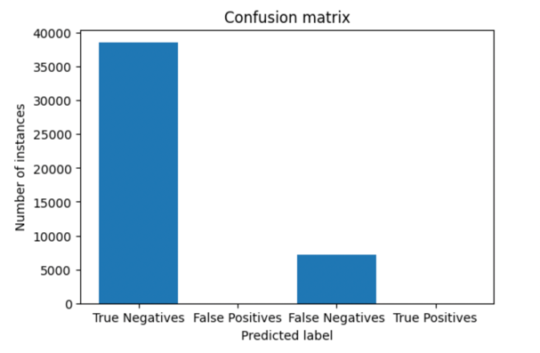
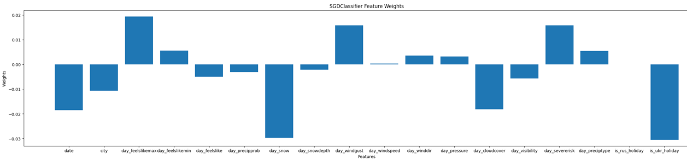

1. Model: Stochastic Gradient Descent Classifier
2. Link to colab: https://colab.research.google.com/drive/1jjIW7e3aYZ-0ZBwst00C_-aTT0IyPh4W?usp=sharing
3. Confusion Matrix:
   
   True Positive: 0
   True Negative: 38521
   False Positive: 0
   False Negative: 7152

4. File: sgdc.pickle
5. Tuning of hyper params did not give any positive boost
6. Feature weights: . Top features: day_feelslikemax, day_windgust, day_severerisk